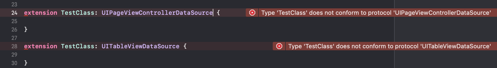
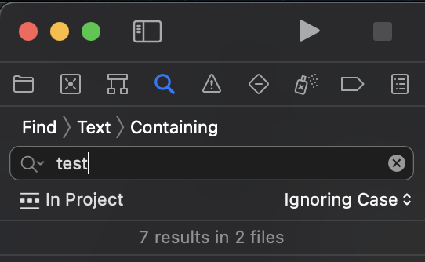

# Markdown cheatsheet

```swift
struct Animal {
    let nickName : String?
}
```

Image syntax:
```

```

Side by side images:
'''
Search                     |  Search Expanded
:-------------------------:|:-------------------------:
  |   
'''