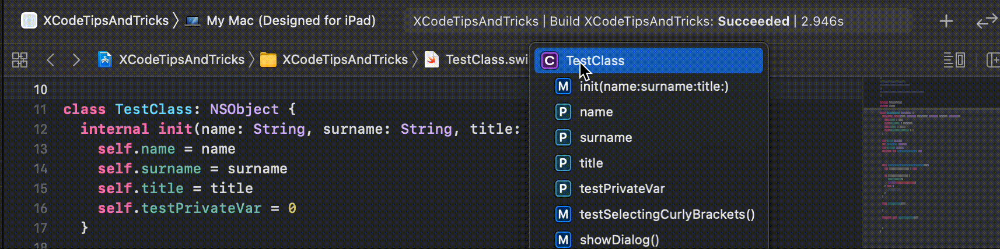

# Xcode tips & tricks

0. #### Useful shortcuts
* **cmd + \** - set breakpoint on current line (doesn't work with 1Password installed)
* **ctrl + i** - reindent code
* **ctrl + alt + cmd + G** - re-run last test
* **cmd + shift + J** - shows current file in Project Navigator

1. #### Generating class initializers

```swift
class TestClass {
  var name: String
  var surname: String
  let title: String
}
```
* Select class name
* Editor -> Refactor -> Generate Memberwise Initializer 
```swift
class TestClass {
  internal init(name: String, surname: String, title: String) {
    self.name = name
    self.surname = surname
    self.title = title
  }
  
  var name: String
  var surname: String
  let title: String
}
```

2. #### Fixing all issues at once


* Instead of fixing errors one by one we can click:

* **Editor -> Fix All Issues**
 
3. #### Selecting blocks of code
* Double click on curly bracket to select whole code block


4. #### Reindent code
* Select code and press **'ctrl + i'** 
* To automatically reindent code while pasting into project set:
* **Settings -> Text Editing -> Indentation -> select 'Re-Indent on paste'**

5. #### Search whole project tips

* CMD + Shift + F
* Find -> Text -> Containing - we can click on every part to expand search criteria
* We can click delete on selected search result to remove search from search results

Search                     |  Search Expanded
:-------------------------:|:-------------------------:
  |   
* Press magnifying glass icon to show recent searches:


6. #### Show interface of swift file
* Press 'CMD + ctrl + UP"
* Showing only publicly accessible variables and method header (similar to Obj-C .h file)
* Doesn't show private vars/functions

7. #### Typing in bars



* It works in many bars - ex. filtering simulators

8. #### Checking spelling
* Edit -> Format -> Spelling and Grammar -> Show Spelling and Grammar
* Works in strings
* Works also with variable names using camel case: if we wanted to name variable as 'setDistance' but named it setDitsance, it should be marked as error.

9. #### Tiling the simulator
*  Window -> Tile Window to Right of Screen

10. #### Autocompletion
* press 'cmd + space' to show autocomplete
* Autocompletion window can be resized as any other window
 
11. #### Randomizing test order

* Product -> Test -> Info -> Options -> Randomize execution order 

12. Show source code changes
* Clicking on the blue line on the left side of line number shows git changes


